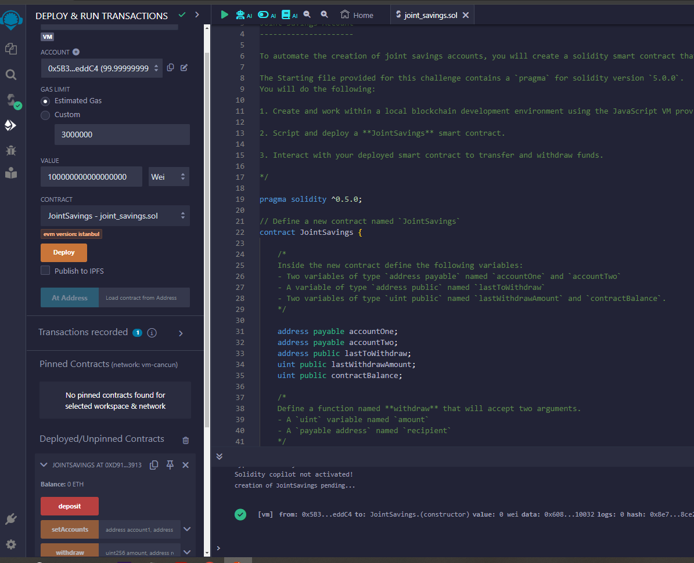
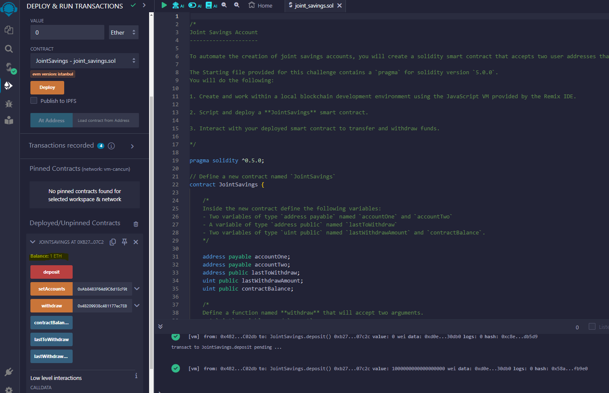
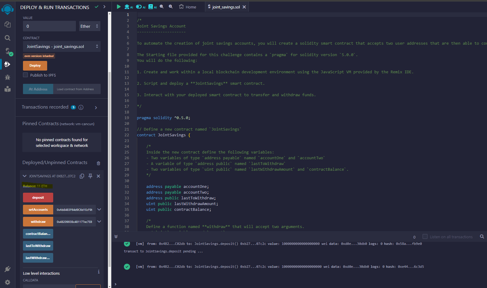
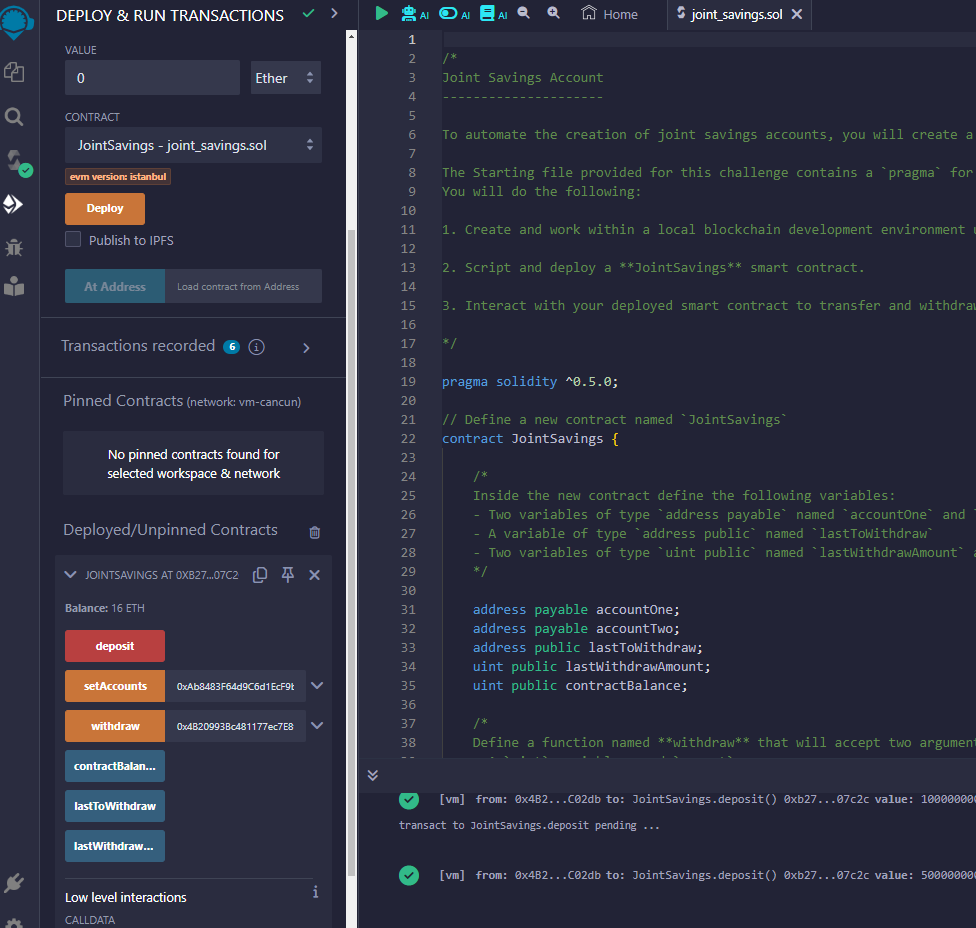
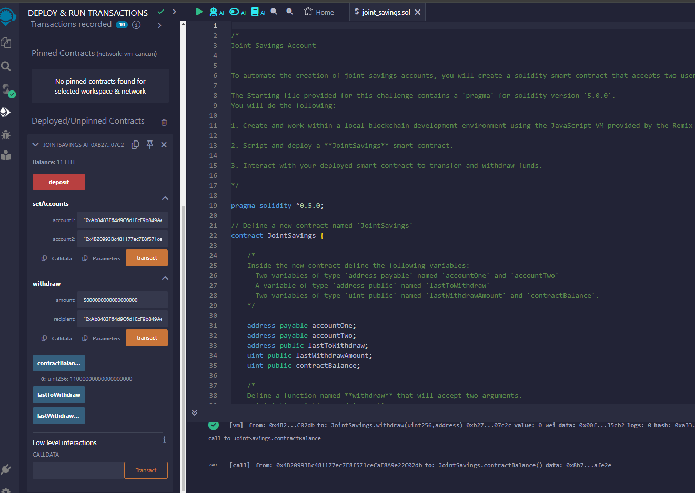
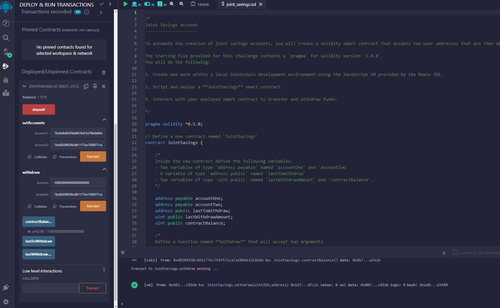
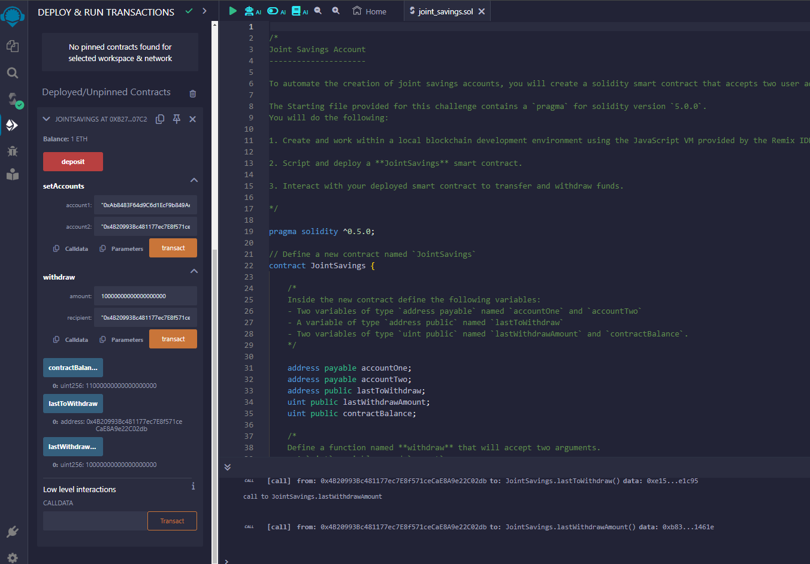

# challenge_20
# Joint Savings Smart Contract

## Background

This project focuses on developing a blockchain solution that connects financial institutions using an Ethereum-compatible blockchain. The goal is to automate various financial processes and features using smart contracts. One key feature is the creation of joint savings accounts that can be controlled by two users. The smart contract will be implemented in Solidity, a programming language designed specifically for developing smart contracts on the Ethereum blockchain.

## Overview

### Components

1. **JointSavings Solidity Smart Contract**: A smart contract written in Solidity that enables two user addresses to manage a joint savings account with functionalities for depositing and withdrawing Ether.
2. **Execution_Results Folder**: A folder containing images demonstrating the successful deposit and withdrawal transactions, validating the functionality of the JointSavings contract within the JavaScript VM.

### Smart Contract Details

#### `deposit`

```solidity
function deposit() public payable
```

This function allows anyone to deposit Ether into the contract. The contract balance is updated accordingly.

#### `withdraw`

```solidity
function withdraw(uint amount, address payable recipient) public
```

This function allows the authorized accounts (`accountOne` or `accountTwo`) to withdraw a specified amount of Ether from the contract.

- **Parameters**:
  - `amount`: The amount of Ether to withdraw.
  - `recipient`: The address to receive the Ether. Must be either `accountOne` or `accountTwo`.
- **Require Statements**:
  - Ensures the `recipient` is `accountOne` or `accountTwo`.
  - Checks if the contract has sufficient balance for the withdrawal.
- **Updates**:
  - `lastToWithdraw` if the recipient is different from the last withdrawer.
  - `lastWithdrawAmount` with the amount withdrawn.
  - `contractBalance` with the new balance of the contract.

#### `setAccounts`

```solidity
function setAccounts(address payable account1, address payable account2) public
```

This function sets the authorized withdrawal accounts.

- **Parameters**:
  - `account1`: The first authorized account.
  - `account2`: The second authorized account.

### Fallback Function

```solidity
function() external payable
```

A fallback function to receive Ether sent directly to the contract outside of the `deposit` function. It updates the contract balance.

## Execution Results

The `Execution_Results` folder contains images that demonstrate the following:

1. Successful deployment of the `JointSavings` contract.
2. Setting the authorized accounts using the `setAccounts` function.
3. Depositing Ether into the contract using the `deposit` function.
4. Validating the contract balance updates after each transaction.
5. Withdrawing Ether from the contract using the `withdraw` function.
6. Ensuring the correct `lastToWithdraw` and `lastWithdrawAmount` are recorded after each withdrawal.
7. Successful handling of Ether sent directly to the contract via the fallback function.

### Screenshots of various stages of transactions.

1. **Deployment Confirmation**
   
   
2. **Setting Accounts**
   
   
3. **Initial Deposit**
   
   
4. **Balance Check 16ETH**
   
   
5. **First Withdrawal**
   
   
6. **Last Withdraw Details**
   

7. **Withdrawal Function: lastToWithdraw and lastWithdrawn**
   


